# Moonx

Moonx App is a mobile application developed with Flutter. This application provides daily horoscope, lunar tips, weather forecast, and meditation music for users. The application uses the Horoscope API, Lunar API, Weather API, and Audio Player package to fetch the data and play the music.

## Features

- Daily Horoscope:The application uses the Horoscope API to fetch the daily horoscope for each zodiac sign.

- Daily Lunar Tips: The application uses the Lunar API to fetch daily lunar tips.

- Daily Weather: The application uses the Weather API to fetch the daily weather forecast for the user's location.

- Media Player: The application uses the Audio Player package to play meditation music.

## Built With

- [Flutter](https://flutter.dev/)
- [Dart](https://dart.dev/)

## Preview
## Onboarding

    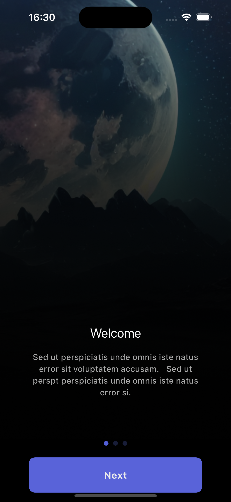
    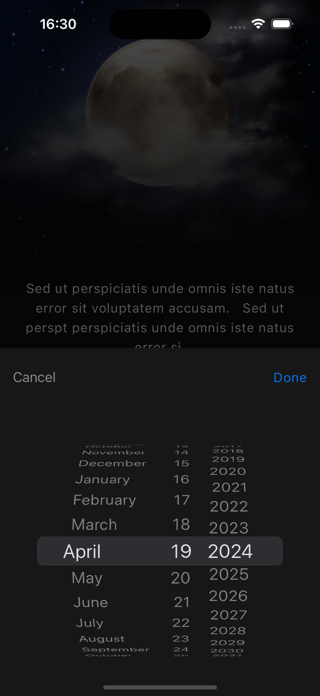
    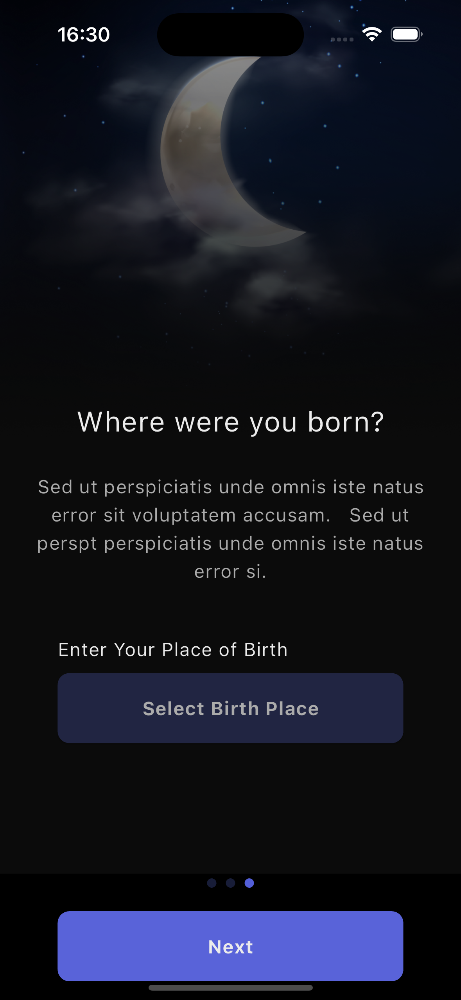

## Home

    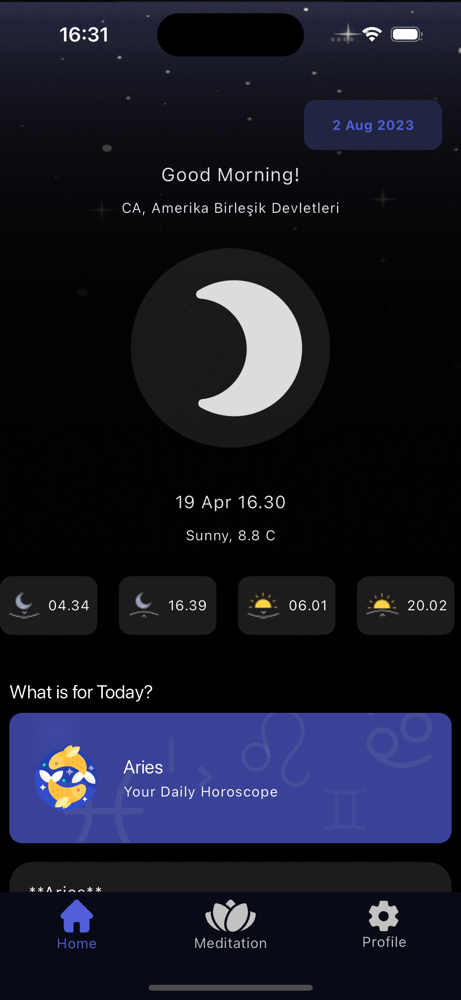
    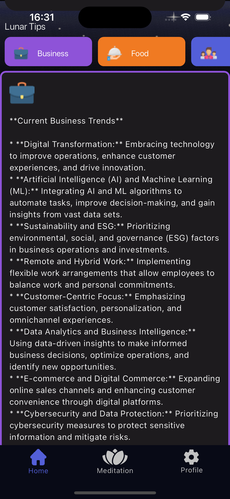
    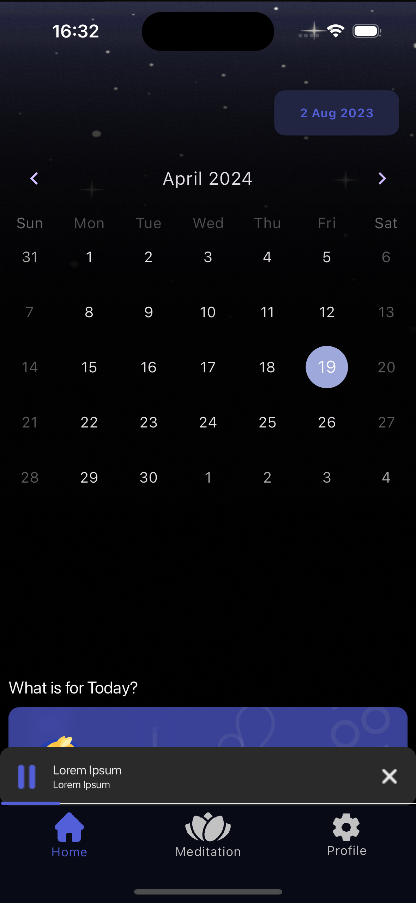

## Meditation

    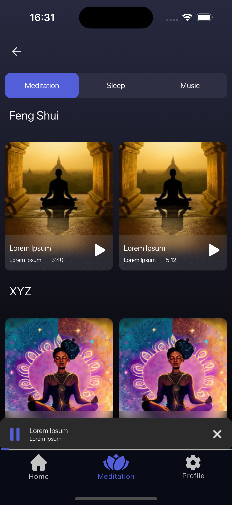
    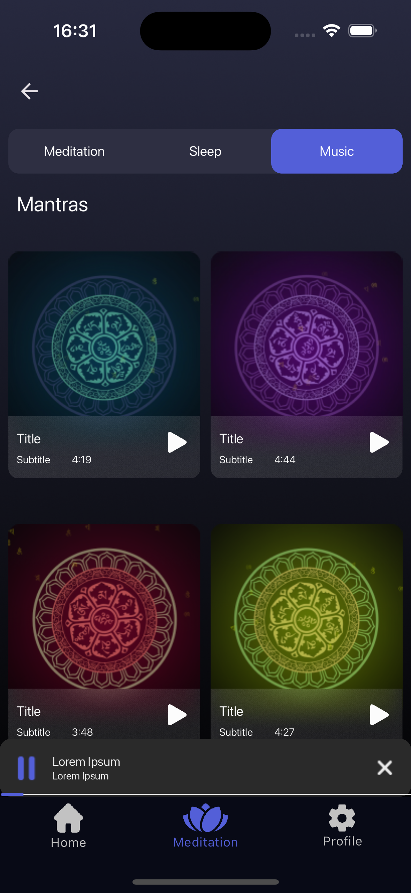
    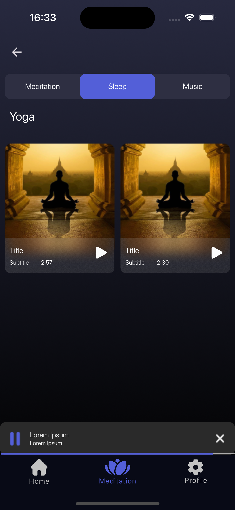

## Profile

    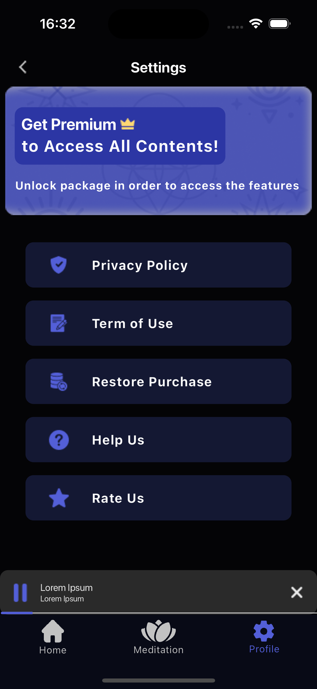

## Song

    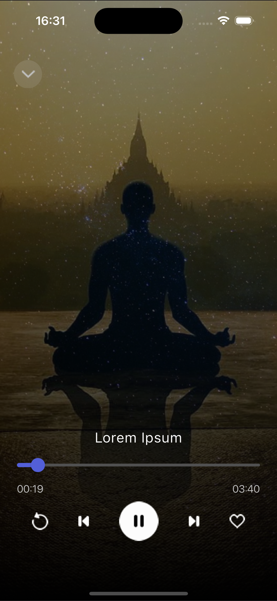

## Packages

- State Management

  - [Bloc](https://pub.dev/packages/flutter_bloc)
  - [Provider](https://pub.dev/packages/provider)

- Caching
  - [HydratedBloc](https://pub.dev/packages/hydrated_bloc)
- Routing
  - [AutoRoute](https://pub.dev/packages/auto_route)
- Dependency Injection
  - [GetIt](https://pub.dev/packages/get_it)
- Utils
  - [Kartal](https://pub.dev/packages/kartal)
- Network
  - [Dio](https://pub.dev/packages/dio)   
- Environment
  - [Envied](https://pub.dev/packages/envied)
- Audio
  - [audioplayers](https://pub.dev/packages/audioplayers)
- Generate Assets
  - [FlutterGen](https://pub.dev/packages/flutter_gen)
- Lint
  - [very_good_analysis](https://pub.dev/packages/very_good_analysis)
- Ai Models
  - [google_generative_ai](https://pub.dev/packages/google_generative_ai)

